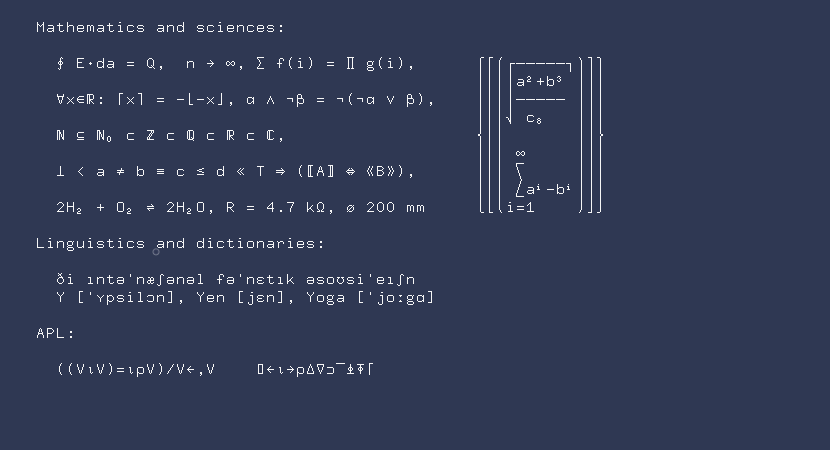
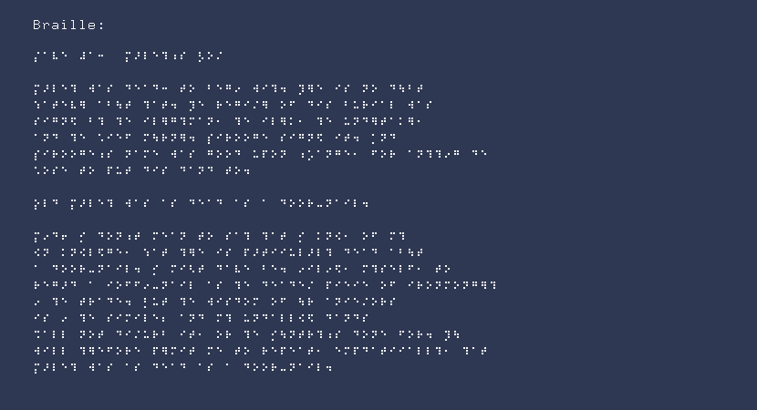

<div align="center">

   <h1 align="center">SeaWolf</h1>

   <p align="center">
     An interactive environment with the use of
      <a href="https://www.khronos.org/opengl">OpenGL</a>
      and
      <a href="https://www.glfw.org/">GLFW</a>
   </p>

</div>
<br />

### Getting Started

For more info see [getting started](examples/README.md).

### Examples

``` c
#include "seawolf.h"

int main( void )
{
   const char *text[] = {
      "",
      "Mathematics and sciences:",
      "",
      "  ∮ E⋅da = Q,  n → ∞, ∑ f(i) = ∏ g(i),      ⎧⎡⎛┌─────┐⎞⎤⎫",
      "                                            ⎪⎢⎜│a²+b³ ⎟⎥⎪",
      "  ∀x∈ℝ: ⌈x⌉ = −⌊−x⌋, α ∧ ¬β = ¬(¬α ∨ β),    ⎪⎢⎜│───── ⎟⎥⎪",
      "                                            ⎪⎢⎜⎷ c₈   ⎟⎥⎪",
      "  ℕ ⊆ ℕ₀ ⊂ ℤ ⊂ ℚ ⊂ ℝ ⊂ ℂ,                   ⎨⎢⎜       ⎟⎥⎬",
      "                                            ⎪⎢⎜ ∞     ⎟⎥⎪",
      "  ⊥ < a ≠ b ≡ c ≤ d ≪ ⊤ ⇒ (A ⇔ ⟪B⟫),      ⎪⎢⎜ ⎲     ⎟⎥⎪",
      "                                            ⎪⎢⎜ ⎳aⁱ-bⁱ⎟⎥⎪",
      "  2H₂ + O₂ ⇌ 2H₂O, R = 4.7 kΩ, ⌀ 200 mm     ⎩⎣⎝i=1    ⎠⎦⎭",
      "",
      "Linguistics and dictionaries:",
      "",
      "  ði ıntəˈnæʃənəl fəˈnɛtık əsoʊsiˈeıʃn",
      "  Y [ˈʏpsilɔn], Yen [jɛn], Yoga [ˈjoːgɑ]",
      "",
      "APL:",
      "",
      "  ((V⍳V)=⍳⍴V)/V←,V    ⌷←⍳→⍴∆∇⊃‾⍎⍕⌈"
   };

   int num_lines = LEN( text );

   sw_CreateWindow( 830, 450, "sw_Text" );

   sw_LoadFont_9x18_BDF( "../../font/9x18.bdf" );

   while( ! sw_MainLoop() && ! sw_GetKey( KEY_ESCAPE ) )
   {
      sw_Begin();

         sw_Background( 0x2F3853 );

         for ( int i = 0; i < num_lines; i++ )
         {
            sw_DrawText9x18( 36, i * 18, text[ i ], 0x2F3853, 0xf6f6f6 );
         }

      sw_End();
      sw_WaitEvents();
   }

   sw_CloseWindow();
   return 0;
}

```



``` c
#include "seawolf.h"

int main( void )
{
   const char *text[] = {
      "",
      "Braille:",
      "",
      "⡌⠁⠧⠑ ⠼⠁⠒  ⡍⠜⠇⠑⠹⠰⠎ ⡣⠕⠌",
      "",
      "⡍⠜⠇⠑⠹ ⠺⠁⠎ ⠙⠑⠁⠙⠒ ⠞⠕ ⠃⠑⠛⠔ ⠺⠊⠹⠲ ⡹⠻⠑ ⠊⠎ ⠝⠕ ⠙⠳⠃⠞",
      "⠱⠁⠞⠑⠧⠻ ⠁⠃⠳⠞ ⠹⠁⠞⠲ ⡹⠑ ⠗⠑⠛⠊⠌⠻ ⠕⠋ ⠙⠊⠎ ⠃⠥⠗⠊⠁⠇ ⠺⠁⠎",
      "⠎⠊⠛⠝⠫ ⠃⠹ ⠹⠑ ⠊⠇⠻⠛⠹⠍⠁⠝⠂ ⠹⠑ ⠊⠇⠻⠅⠂ ⠹⠑ ⠥⠝⠙⠻⠞⠁⠅⠻⠂",
      "⠁⠝⠙ ⠹⠑ ⠡⠊⠑⠋ ⠍⠳⠗⠝⠻⠲ ⡎⠊⠗⠕⠕⠛⠑ ⠎⠊⠛⠝⠫ ⠊⠞⠲ ⡁⠝⠙",
      "⡎⠊⠗⠕⠕⠛⠑⠰⠎ ⠝⠁⠍⠑ ⠺⠁⠎ ⠛⠕⠕⠙ ⠥⠏⠕⠝ ⠰⡡⠁⠝⠛⠑⠂ ⠋⠕⠗ ⠁⠝⠹⠹⠔⠛ ⠙⠑",
      "⠡⠕⠎⠑ ⠞⠕ ⠏⠥⠞ ⠙⠊⠎ ⠙⠁⠝⠙ ⠞⠕⠲",
      "",
      "⡕⠇⠙ ⡍⠜⠇⠑⠹ ⠺⠁⠎ ⠁⠎ ⠙⠑⠁⠙ ⠁⠎ ⠁ ⠙⠕⠕⠗⠤⠝⠁⠊⠇⠲",
      "",
      "⡍⠔⠙⠖ ⡊ ⠙⠕⠝⠰⠞ ⠍⠑⠁⠝ ⠞⠕ ⠎⠁⠹ ⠹⠁⠞ ⡊ ⠅⠝⠪⠂ ⠕⠋ ⠍⠹",
      "⠪⠝ ⠅⠝⠪⠇⠫⠛⠑⠂ ⠱⠁⠞ ⠹⠻⠑ ⠊⠎ ⠏⠜⠞⠊⠊⠥⠇⠜⠇⠹ ⠙⠑⠁⠙ ⠁⠃⠳⠞",
      "⠁ ⠙⠕⠕⠗⠤⠝⠁⠊⠇⠲ ⡊ ⠍⠊⠣⠞ ⠙⠁⠧⠑ ⠃⠑⠲ ⠔⠊⠇⠔⠫⠂ ⠍⠹⠎⠑⠇⠋⠂ ⠞⠕",
      "⠗⠑⠛⠜⠙ ⠁ ⠊⠕⠋⠋⠔⠤⠝⠁⠊⠇ ⠁⠎ ⠹⠑ ⠙⠑⠁⠙⠑⠌ ⠏⠊⠑⠊⠑ ⠕⠋ ⠊⠗⠕⠝⠍⠕⠝⠛⠻⠹",
      "⠔ ⠹⠑ ⠞⠗⠁⠙⠑⠲ ⡃⠥⠞ ⠹⠑ ⠺⠊⠎⠙⠕⠍ ⠕⠋ ⠳⠗ ⠁⠝⠊⠑⠌⠕⠗⠎",
      "⠊⠎ ⠔ ⠹⠑ ⠎⠊⠍⠊⠇⠑⠆ ⠁⠝⠙ ⠍⠹ ⠥⠝⠙⠁⠇⠇⠪⠫ ⠙⠁⠝⠙⠎",
      "⠩⠁⠇⠇ ⠝⠕⠞ ⠙⠊⠌⠥⠗⠃ ⠊⠞⠂ ⠕⠗ ⠹⠑ ⡊⠳⠝⠞⠗⠹⠰⠎ ⠙⠕⠝⠑ ⠋⠕⠗⠲ ⡹⠳",
      "⠺⠊⠇⠇ ⠹⠻⠑⠋⠕⠗⠑ ⠏⠻⠍⠊⠞ ⠍⠑ ⠞⠕ ⠗⠑⠏⠑⠁⠞⠂ ⠑⠍⠏⠙⠁⠞⠊⠊⠁⠇⠇⠹⠂ ⠹⠁⠞",
      "⡍⠜⠇⠑⠹ ⠺⠁⠎ ⠁⠎ ⠙⠑⠁⠙ ⠁⠎ ⠁ ⠙⠕⠕⠗⠤⠝⠁⠊⠇⠲"
   };

   int num_lines = LEN( text );

   sw_CreateWindow( 830, 450, "Braille" );

   sw_LoadFont_9x18_BDF( "../../font/9x18.bdf" );

   while( ! sw_MainLoop() && ! sw_GetKey( KEY_ESCAPE ) )
   {
      sw_Begin();

         sw_Background( 0x2F3853 );

            for ( int i = 0; i < num_lines; i++ )
            {
               sw_DrawText9x18( 36, i * 18, text[ i ], 0x2F3853, 0xf6f6f6 );
            }

      sw_End();
      sw_WaitEvents();
   }

   sw_CloseWindow();
   return 0;
}
```

