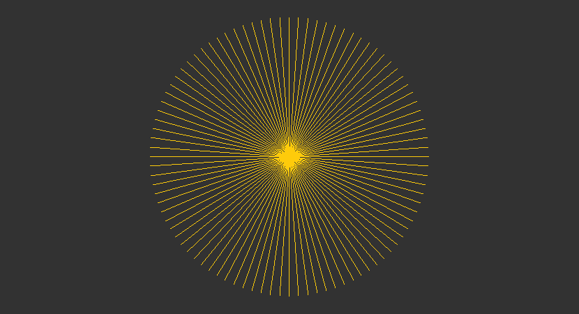

<div align="center">
   <h1 align="center">SeaWolf</h1>
   <br />
   <h1 align="center">Programming in Clipper using C language.</h1>
   <p align="center">
      With the use of
      <a href="https://www.khronos.org/opengl">OpenGL</a>
      and
      <a href="https://www.glfw.org/">GLFW</a>
   </p>
</div>

### Getting Started

For more info see [getting started](examples/README.md).

### Examples

``` c
#include "seawolf.h"

int main( void )
{
   pSeaWolf w;
   const char *text = "Hello Window";
   int x1, y1, x2, y2;
   uint8_t i;
   int n = 46, radius = 100;

   w = sw_CreateWindow( 830, 450, text );

   while( ! sw_MainLoop( w ) && ! sw_GetKey( w, KEY_ESCAPE ) )
   {
      sw_Begin( w );

         x2 = sw_WinWidth( w ) / 2;
         y2 = sw_WinHeight( w ) / 2;

         sw_Background( w, 0x323232 );

         for( i = 0; i < 2 * n; i++ )
         {
            x1 = sin(        i * M_PI / n ) * radius * 2 + x2;
            y1 = cos( M_PI + i * M_PI / n ) * radius * 2 + y2;
            sw_Lines( w, x1, y1, x2, y2, 0xfecb0b );
         }

      sw_End( w );

      sw_WaitEvents( w );
   }

   sw_CloseWindow( w );

   return 0;
}
```

